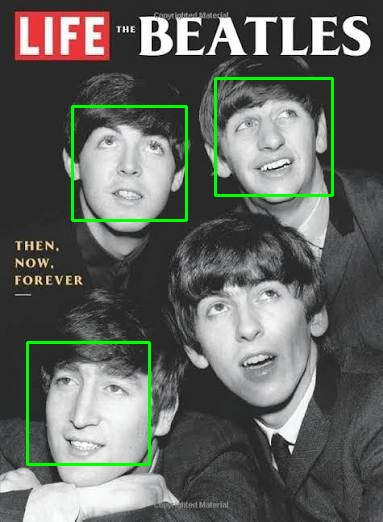
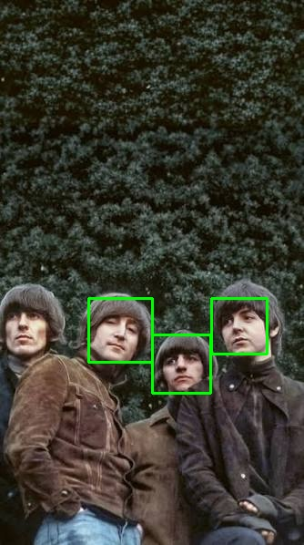
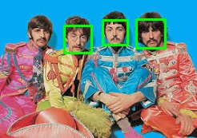

# Face Detection Pipeline Using OpenCV Haar Cascades

<div align="center">
    
</div>

## Overview

This project implements a simple face detection pipeline using OpenCV. The goal of this project is to detect human faces in images and draw bounding boxes around the detected faces.

The project demonstrates the fundamental difference between **face detection** and **face recognition**:

- **Face Detection**: Determines whether an image contains a face and locates the position of detected faces.
- **Face Recognition**: Goes one step further by identifying whose face it is.

This project focuses only on **face detection**.

---

# Task Description

The task is to build a face detection system that:

1. Takes an input image from the user.
2. Detects all faces present in the image.
3. Draws bounding boxes around detected faces.
4. Displays the result.
5. Provides an option to process all images in the image collection and save the outputs.

The system supports two modes:

- **Single Image Mode**: The user selects one image and the detection result is displayed.
- **Batch Processing Mode**: The system processes all images inside the input directory and saves the detected results into an output directory.

---

# Implementation Overview

The project is implemented using:

- Python
- OpenCV
- Haar Cascade Classifier

The pipeline is organized into several components:
```text
main.py
|
|-- User input handling
|
v
pipeline.py
|
|-- Loads Haar Cascade classifier
|-- Controls execution flow
|
v
detect_faces()
|
|-- Loads image
|-- Converts image to grayscale
|-- Detects faces
|-- Draws bounding boxes
|
v
Output
|
|-- Display result
|-- Save processed images

```

The code is separated into different modules to keep each component responsible for a specific task.

---

# Algorithm Overview

## Haar Cascade Face Detection

The project uses OpenCV's Haar Cascade classifier for detecting faces.

Haar Cascade is a classical computer vision algorithm based on:

- Haar-like features
- Integral images
- AdaBoost machine learning
- Cascade classifiers

The classifier has been trained on a large image collection of positive examples (images containing faces) and negative examples (images without faces).

---

## Detection Process

The detection pipeline follows these steps:

### 1. Load the Input Image

The selected image is loaded using OpenCV:

```python
cv.imread()
```
The image is stored as a NumPy array containing pixel information.

### 2. Convert Image to Grayscale

The image is converted from BGR color space to grayscale:
```python
cv.cvtColor(image, cv.COLOR_BGR2GRAY)
```
This is done because Haar Cascade detection works on intensity information rather than color.

### 3. Apply Haar Cascade Classifier
The grayscale image is passed to the classifier:
```python
detectMultiScale()
```
The classifier scans the image at multiple scales to detect possible face regions.

The parameters used are:
- `scaleFactor`: Controls how much the image size is reduced during each scale step.
- `minNeighbors`: Controls how strict the detection is.
Higher values reduce false positives but may miss some faces.

### 4. Extract Face Coordinates
For every detected face, the classifier returns:
- x-coordinate
- y-coordinate
- width
- height
These values define the bounding rectangle around each detected face.

### 5. Draw Bounding Boxes
The detected coordinates are used to draw rectangles around faces:
```python
cv.rectangle()
```
The final image contains visual indications of detected faces.

During detection, the classifier evaluates different regions of the image and rejects non-face regions through a cascade of increasingly complex classifiers.

# Project Overview
```text
📁 _15_face_detection
├── 📁 assets
│   ├── 📁 images
│   │   ├── 🖼️ b1.jpg
│   │   ├── 🖼️ b2.jpg
│   │   ├── 🖼️ b3.jpg
│   │   ├── 🖼️ gh1.jpg
│   │   ├── 🖼️ gh2.jpg
│   │   ├── 🖼️ gh3.jpg
│   │   ├── 🖼️ jl1.jpg
│   │   ├── 🖼️ jl2.jpg
│   │   ├── 🖼️ pm1.jpg
│   │   ├── 🖼️ pm2.jpg
│   │   ├── 🖼️ pm3.jpg
│   │   ├── 🖼️ rs1.jpg
│   │   ├── 🖼️ rs2.jpg
│   │   ├── 🖼️ rs3.jpg
│   │   ├── 🖼️ tb1.jpg
│   │   ├── 🖼️ tb2.jpg
│   │   ├── 🖼️ tb3.jpg
│   │   ├── 🖼️ tb4.jpg
│   │   ├── 🖼️ tb5.jpg
│   │   ├── 🖼️ tb6.jpg
│   │   └── 🖼️ tb7.jpg
│   ├── 📁 outputs
│   │   ├── 🖼️ b1.jpg
│   │   ├── 🖼️ b2.jpg
│   │   ├── 🖼️ b3.jpg
│   │   ├── 🖼️ gh1.jpg
│   │   ├── 🖼️ gh2.jpg
│   │   ├── 🖼️ gh3.jpg
│   │   ├── 🖼️ jl1.jpg
│   │   ├── 🖼️ jl2.jpg
│   │   ├── 🖼️ pm1.pg.jpg
│   │   ├── 🖼️ pm2.jpg
│   │   ├── 🖼️ pm3.jpg
│   │   ├── 🖼️ rs1.jpg
│   │   ├── 🖼️ rs2.jpg
│   │   ├── 🖼️ rs3.jpg
│   │   ├── 🖼️ tb1.jpg
│   │   ├── 🖼️ tb2.jpg
│   │   ├── 🖼️ tb3.jpg
│   │   ├── 🖼️ tb4.jpg
│   │   ├── 🖼️ tb5.jpg
│   │   ├── 🖼️ tb6.jpg
│   │   └── 🖼️ tb7.jpg
│   └── 📁 source
│       └── 📄 haar_face.xml
├── 📁 config
│   ├── 🐍 constants.py
│   └── 🐍 paths.py
├── 📁 utils
│   ├── 🐍 detect_faces.py
│   ├── 🐍 greyscale.py
│   ├── 🐍 print_cords.py
│   ├── 🐍 saver.py
│   └── 🐍 xml_loader.py
├── 🐍 main.py
├── 🐍 pipeline.py
└── 📘 README.md
```
# Running the Project
Open the Face Detection directory:
```bash
cd _15_face_detection
```
Install the required dependency:
```bash
pip install -r face_detection_requirements.txt
```
Run the project:
```bash
python main.py
```
The program will ask you to select:
```text
What file do you want to perform Face Detection on?

1. image1.jpg
2. image2.jpg
3. image3.jpg
...

0. All
```
> Outputs will only be saved when All option is selected.

# Outputs Analysis

## Dataset Overview

The face detection pipeline was evaluated on a collection of **21 images** containing both human faces and non-human subjects.

The dataset includes images of:

- The Beatles (musical band)
- Beetle insects (non-human images)

The human face images consist of:

- 3 images of George Harrison
- 2 images of John Lennon
- 3 images of Paul McCartney
- 3 images of Ringo Starr
- 7 group images of The Beatles

The dataset contains a mixture of:

- Colored and grayscale images.
- Old and modern photographs.
- Individual portraits and group photographs.

The inclusion of beetle insect images provides negative samples to evaluate whether the detector incorrectly identifies non-face objects as human faces.

---

# Overall Detection Performance

The Haar Cascade face detector performed well on simple frontal-face images and successfully rejected the non-human images containing beetles.

The detector successfully:

- Detected all single-person frontal images.
- Correctly identified images without human faces.
- Successfully located most visible faces in group photographs.

However, the performance decreased in more challenging scenarios, especially when:

- Faces were small due to low image resolution.
- Faces were partially rotated away from the camera.
- Facial appearance differed from the patterns learned by the classifier.
- Non-face regions contained patterns similar to facial structures.

Overall, the detector achieved good results considering that Haar Cascade is a classical computer vision method and does not use deep learning-based feature extraction.

---

# Successful Detection Cases

## Single Face Images

The detector performed very well on individual portraits where the face was:

- Large in the image.
- Clearly visible.
- Facing approximately toward the camera.
- Not affected by heavy occlusion.

For these images, the Haar Cascade classifier was able to accurately locate the face region.

<div align="center">

</div>

*Example: Successful detection on a single-face image.*

---

## Negative Samples

The three beetle insect images were correctly classified as containing no faces.

This demonstrates that the detector did not simply detect arbitrary objects and was able to distinguish between human facial patterns and unrelated objects.

<div align="center">

</div>

*Example: Negative samples where no faces were detected.*

---

# False Positive Detection

In two images, the detector incorrectly identified parts of the person's collar as faces.

<div align="center">

</div>

*Example: False positive detection on clothing regions.*

This behavior is a known limitation of Haar Cascade classifiers.

The classifier does not understand the semantic meaning of a face. Instead, it searches for combinations of visual patterns similar to the Haar features learned during training.

Certain regions of clothing can sometimes contain patterns that resemble facial structures, such as:

- High-contrast edges.
- Symmetrical shapes.
- Dark and bright regions resembling eyes and mouth patterns.

Because of this, the classifier may occasionally produce false detections in regions that visually resemble a face.

---

# Failure Cases

## Missed Face in Group Image Due to Resolution

In one group image, the detector failed to identify several faces.

<div align="center">

</div>

*Example: Missed detections caused by low image resolution.*

The main reason for this failure is likely the limited resolution of the image.

When the image was enlarged, the faces appeared pixelated, meaning that important facial details were lost. Haar Cascade relies heavily on local intensity patterns and edges, so when a face contains insufficient detail, the classifier may not find enough matching features.

---

## Missed Detection Due to Face Appearance Variation

In another group image, one face was not detected despite having relatively high image quality.

<div align="center">

</div>

*Example: Missed detection despite good image quality.*

Although the image quality was sufficient, the face appearance differed from the patterns expected by the Haar Cascade classifier.

Possible factors include:

- Slight changes in head orientation.
- Different facial expressions.
- Open mouth position.
- Differences in facial features compared to the training samples.

Since Haar Cascade mainly detects patterns associated with frontal faces, small deviations can reduce detection reliability.

---

## Missed Detection Due to Face Orientation

In another image, George Harrison's face from the *Revolver* album cover was not detected.

<div align="center">

</div>

*Example: Missed detection caused by face orientation.*

The likely reason is the face angle.

The person is looking away from the camera, causing the facial structure to differ from the frontal-face patterns used by the classifier.

Haar Cascade performs best on frontal faces and generally becomes less reliable for:

- Side profiles.
- Rotated faces.
- Faces with significant changes in perspective.

---

## Missed Detection Despite Similar Appearance

One group image failed to detect Ringo Starr's face even though he was looking toward the camera.

<div align="center">

</div>

*Example: Missed detection of a frontal face.*

Initially, this failure appeared to be related to hair covering part of the face. However, similar cases existed where other faces with hair partially covering the face were detected successfully.

This suggests that the failure was likely caused by a combination of factors rather than a single issue, such as:

- Exact face position.
- Local contrast patterns.
- Facial expression.
- Interaction between hair, shadows, and facial features.

Haar Cascade classifiers can be sensitive to small variations in appearance, which may cause inconsistent results between visually similar cases.

---

# Detection Parameters

The detector was configured using the following parameters:

```python
SCALE_FACTOR = 1.1
MINIMUM_NEIGHBOURS = 3
```
The parameters were not modified during evaluation.

The `scaleFactor` controls the image pyramid scaling process, determining how aggressively the detector searches at different image sizes.

The `minNeighbors` parameter controls detection strictness:
- Lower values allow more detections but may increase false positives.
- Higher values reduce false positives but may miss some faces.
The selected values provided a reasonable balance between detecting faces and avoiding excessive false detections.
---
# Processing Speed
The batch detection process was completed in approximately less than two seconds for all 21 images.
This demonstrates one of the main advantages of Haar Cascade classifiers:
- Low computational cost.
- Fast inference.
- Suitable for real-time applications with limited hardware resources.
---
# Overall Conclusion
The Haar Cascade face detector performed effectively for clear frontal-face images and demonstrated very fast processing speed.
The results show that the algorithm is suitable for simple face detection tasks, especially when:
- Faces are large and visible.
- Images have good lighting.
- Faces are approximately frontal.
However, the experiments also demonstrate the limitations of classical feature-based detectors. Performance decreases when dealing with:
- Low-resolution images.
- Non-frontal faces.
- Facial appearance variations.
- Complex group photographs.
Modern deep learning-based face detectors would likely provide higher robustness in these challenging scenarios, but Haar Cascade remains a lightweight and efficient solution for basic face detection applications.
# Limitations
Although Haar Cascade is fast and lightweight, it has several limitations:
- It may struggle with faces that are not frontal.
- It is sensitive to lighting conditions.
- It can produce false positives.
- It is less robust compared to modern deep learning-based detectors.
More advanced approaches, such as CNN-based face detectors, generally provide better accuracy but require more computational resources.
# Future Improvements
Possible extensions of this project include:
- Replacing Haar Cascade with a deep learning-based detector.
- Adding confidence scores.
- Supporting video and webcam detection.
- Comparing classical and deep learning approaches.
# License
[MIT LICENSE](LICENSE)