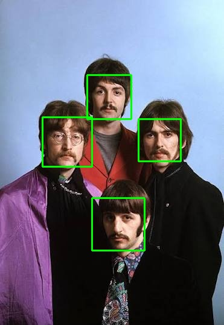

# Face Detection Pipeline Using OpenCV Haar Cascades



## Overview

This project implements a simple face detection pipeline using OpenCV. The goal of this project is to detect human faces in images and draw bounding boxes around the detected faces.

The project demonstrates the fundamental difference between **face detection** and **face recognition**:

- **Face Detection**: Determines whether an image contains a face and locates the position of detected faces.
- **Face Recognition**: Goes one step further by identifying whose face it is.

This project focuses only on **face detection**.

---

# Task Description

The task is to build a face detection system that:

1. Takes an input image from the user.
2. Detects all faces present in the image.
3. Draws bounding boxes around detected faces.
4. Displays the result.
5. Provides an option to process all images in the image collection and save the outputs.

The system supports two modes:

- **Single Image Mode**: The user selects one image and the detection result is displayed.
- **Batch Processing Mode**: The system processes all images inside the input directory and saves the detected results into an output directory.

---

# Implementation Overview

The project is implemented using:

- Python
- OpenCV
- Haar Cascade Classifier

The pipeline is organized into several components:
```text
main.py
|
|-- User input handling
|
v
pipeline.py
|
|-- Loads Haar Cascade classifier
|-- Controls execution flow
|
v
detect_faces()
|
|-- Loads image
|-- Converts image to grayscale
|-- Detects faces
|-- Draws bounding boxes
|
v
Output
|
|-- Display result
|-- Save processed images

```

The code is separated into different modules to keep each component responsible for a specific task.

---

# Algorithm Overview

## Haar Cascade Face Detection

The project uses OpenCV's Haar Cascade classifier for detecting faces.

Haar Cascade is a classical computer vision algorithm based on:

- Haar-like features
- Integral images
- AdaBoost machine learning
- Cascade classifiers

The classifier has been trained on a large image collection of positive examples (images containing faces) and negative examples (images without faces).

---

## Detection Process

The detection pipeline follows these steps:

### 1. Load the Input Image

The selected image is loaded using OpenCV:

```python
cv.imread()
```
The image is stored as a NumPy array containing pixel information.

### 2. Convert Image to Grayscale

The image is converted from BGR color space to grayscale:
```python
cv.cvtColor(image, cv.COLOR_BGR2GRAY)
```
This is done because Haar Cascade detection works on intensity information rather than color.

### 3. Apply Haar Cascade Classifier
The grayscale image is passed to the classifier:
```python
detectMultiScale()
```
The classifier scans the image at multiple scales to detect possible face regions.

The parameters used are:
- `scaleFactor`: Controls how much the image size is reduced during each scale step.
- `minNeighbors`: Controls how strict the detection is.
Higher values reduce false positives but may miss some faces.

### 4. Extract Face Coordinates
For every detected face, the classifier returns:
- x-coordinate
- y-coordinate
- width
- height
These values define the bounding rectangle around each detected face.

### 5. Draw Bounding Boxes
The detected coordinates are used to draw rectangles around faces:
```python
cv.rectangle()
```
The final image contains visual indications of detected faces.

During detection, the classifier evaluates different regions of the image and rejects non-face regions through a cascade of increasingly complex classifiers.

# Project Overview
```text
📁 _15_face_detection
├── 📁 assets
│   ├── 📁 images
│   │   ├── 🖼️ b1.jpg
│   │   ├── 🖼️ b2.jpg
│   │   ├── 🖼️ b3.jpg
│   │   ├── 🖼️ gh1.jpg
│   │   ├── 🖼️ gh2.jpg
│   │   ├── 🖼️ gh3.jpg
│   │   ├── 🖼️ jl1.jpg
│   │   ├── 🖼️ jl2.jpg
│   │   ├── 🖼️ pm1.jpg
│   │   ├── 🖼️ pm2.jpg
│   │   ├── 🖼️ pm3.jpg
│   │   ├── 🖼️ rs1.jpg
│   │   ├── 🖼️ rs2.jpg
│   │   ├── 🖼️ rs3.jpg
│   │   ├── 🖼️ tb1.jpg
│   │   ├── 🖼️ tb2.jpg
│   │   ├── 🖼️ tb3.jpg
│   │   ├── 🖼️ tb4.jpg
│   │   ├── 🖼️ tb5.jpg
│   │   ├── 🖼️ tb6.jpg
│   │   └── 🖼️ tb7.jpg
│   ├── 📁 outputs
│   │   ├── 🖼️ b1.jpg
│   │   ├── 🖼️ b2.jpg
│   │   ├── 🖼️ b3.jpg
│   │   ├── 🖼️ gh1.jpg
│   │   ├── 🖼️ gh2.jpg
│   │   ├── 🖼️ gh3.jpg
│   │   ├── 🖼️ jl1.jpg
│   │   ├── 🖼️ jl2.jpg
│   │   ├── 🖼️ pm1.pg.jpg
│   │   ├── 🖼️ pm2.jpg
│   │   ├── 🖼️ pm3.jpg
│   │   ├── 🖼️ rs1.jpg
│   │   ├── 🖼️ rs2.jpg
│   │   ├── 🖼️ rs3.jpg
│   │   ├── 🖼️ tb1.jpg
│   │   ├── 🖼️ tb2.jpg
│   │   ├── 🖼️ tb3.jpg
│   │   ├── 🖼️ tb4.jpg
│   │   ├── 🖼️ tb5.jpg
│   │   ├── 🖼️ tb6.jpg
│   │   └── 🖼️ tb7.jpg
│   └── 📁 source
│       └── 📄 haar_face.xml
├── 📁 config
│   ├── 🐍 constants.py
│   └── 🐍 paths.py
├── 📁 utils
│   ├── 🐍 detect_faces.py
│   ├── 🐍 greyscale.py
│   ├── 🐍 print_cords.py
│   ├── 🐍 saver.py
│   └── 🐍 xml_loader.py
├── 🐍 main.py
├── 🐍 pipeline.py
└── 📘 README.md
```
# Running the Project
Open the Face Detection directory:
```bash
cd _15_face_detection
```
Install the required dependency:
```bash
pip install -r face_detection_requirements.txt
```
Run the project:
```bash
python main.py
```
The program will ask you to select:
```text
What file do you want to perform Face Detection on?

1. image1.jpg
2. image2.jpg
3. image3.jpg
...

0. All
```
> Outputs will only be saved when All option is selected.

# Results Analysis

# Limitations
Although Haar Cascade is fast and lightweight, it has several limitations:
- It may struggle with faces that are not frontal.
- It is sensitive to lighting conditions.
- It can produce false positives.
- It is less robust compared to modern deep learning-based detectors.
More advanced approaches, such as CNN-based face detectors, generally provide better accuracy but require more computational resources.
# Future Improvements
Possible extensions of this project include:
- Replacing Haar Cascade with a deep learning-based detector.
- Adding confidence scores.
- Supporting video and webcam detection.
- Comparing classical and deep learning approaches.
# License
[MIT LICENSE](LICENSE)