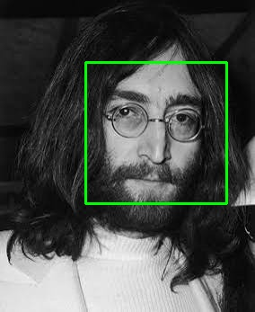
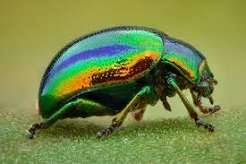
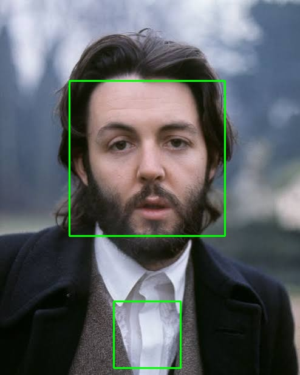
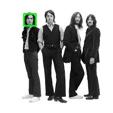

# Face Detection Pipeline Using OpenCV Haar Cascades

<div align="center">
    
</div>

## Overview

A simple face detection pipeline built with OpenCV that detects human faces in images and draws bounding boxes around them.

This project focuses on **face detection** (locating faces), not **face recognition** (identifying whose face it is).

---

## Task Description

The system:

1. Takes an input image from the user.
2. Detects all faces present.
3. Draws bounding boxes around detected faces.
4. Displays the result.
5. Optionally batch-processes the entire image collection and saves outputs.

**Modes:**
- **Single Image Mode** — select one image, view the result.
- **Batch Mode** — process every image in the input directory and save results to the output directory.

---

## Implementation Overview

Built with **Python**, **OpenCV**, and a **Haar Cascade Classifier**.

```text
main.py  →  pipeline.py  →  detect_faces()  →  Output
(user     (loads Haar      (loads image,      (display +
 input)    cascade,         grayscale,          save)
           controls flow)   detects, draws
                             boxes)
```

Code is split into modules so each component has a single responsibility.

---

## Algorithm Overview

The classifier uses **Haar-like features**, **integral images**, **AdaBoost**, and a **cascade of classifiers**, trained on positive (face) and negative (non-face) samples.

**Detection steps:**

1. **Load image** — `cv.imread()` reads the image into a NumPy array.
2. **Convert to grayscale** — `cv.cvtColor(image, cv.COLOR_BGR2GRAY)`, since Haar detection relies on intensity, not color.
3. **Run the classifier** — `detectMultiScale()` scans the image at multiple scales.
   - `scaleFactor`: how much the image shrinks at each scale step.
   - `minNeighbors`: detection strictness — higher values cut false positives but may miss faces.
4. **Extract coordinates** — each detection returns `(x, y, width, height)`.
5. **Draw bounding boxes** — `cv.rectangle()` marks each detected face on the output image.

---

## Project Structure

```text
📁 _15_face_detection
├── 📁 assets
│   ├── 📁 images/     # input images (21 total)
│   ├── 📁 outputs/     # processed images with bounding boxes
│   └── 📁 source/
│       └── haar_face.xml
├── 📁 config
│   ├── constants.py
│   └── paths.py
├── 📁 utils
│   ├── detect_faces.py
│   ├── greyscale.py
│   ├── print_cords.py
│   ├── saver.py
│   └── xml_loader.py
├── main.py
├── pipeline.py
└── README.md
```

---

## Running the Project

```bash
cd _15_face_detection
pip install -r face_detection_requirements.txt
python main.py
```

You'll be prompted to select an image:

```text
What file do you want to perform Face Detection on?

1. image1.jpg
2. image2.jpg
3. image3.jpg
...

0. All
```

> Outputs are only saved to disk when option `0` (All) is selected.

---

## Dataset

21 images total:

- **The Beatles** — 3 George Harrison, 2 John Lennon, 3 Paul McCartney, 3 Ringo Starr, 7 group photos
- **Beetle insects** — negative samples, to test for false positives on non-face objects

The set mixes color/grayscale, old/modern, and solo/group photos.

**Detection parameters used (unchanged throughout evaluation):**

```python
SCALE_FACTOR = 1.1
MINIMUM_NEIGHBOURS = 3
```

---

## Results

### Overall Performance

The detector handled simple frontal faces well and correctly rejected all beetle images (no false detections on non-face objects). It struggled more with:

- Small/low-resolution faces
- Rotated or non-frontal faces
- Faces that deviated from typical training patterns
- Background regions with face-like patterns

Batch processing all 21 images took **under 2 seconds**, highlighting Haar Cascade's low computational cost and suitability for real-time or low-resource use cases.

### Successful Detections

Large, clearly visible, front-facing portraits were detected reliably:

<div align="center">

</div>

*Successful detection on a single-face image.*

All beetle images were correctly identified as containing no faces, confirming the classifier isn't just flagging arbitrary objects:

<div align="center">

</div>

*Negative sample — no faces detected.*

### False Positives

In two images, the classifier mistook a collar for a face:

<div align="center">

</div>

*False positive on a clothing region.*

This happens because Haar Cascade matches visual patterns (contrast edges, symmetry, light/dark regions), not semantic understanding of "face" — clothing folds can occasionally mimic these patterns.

### Failure Cases

| Case | Likely Cause |
|---|---|
| Missed faces in a low-res group photo | Faces became pixelated at scale, losing the detail Haar features depend on |
| Missed a clear, high-quality face | Slight orientation/expression differences from training patterns |
| Missed a profile face (Revolver album cover) | Haar Cascade is tuned for frontal faces; side angles reduce reliability |
| Missed a frontal face despite similar cases being detected | Likely a combination of factors (exact position, contrast, hair/shadow interaction) rather than one clear cause |

<div align="center">

</div>

*Missed detections due to low resolution.*

---

## Conclusion

Haar Cascade performs well on clear, frontal, well-lit faces and is extremely fast — making it a solid lightweight option for basic detection tasks. It's less reliable on low-resolution images, non-frontal faces, and appearance variation, where modern deep learning-based detectors would likely do better.

## Limitations

- Struggles with non-frontal faces
- Sensitive to lighting conditions
- Prone to occasional false positives
- Less robust than deep learning-based detectors

## Future Improvements

- Swap in a deep learning-based face detector
- Add confidence scores to detections
- Support video/webcam input
- Benchmark classical vs. deep learning approaches

## License

[MIT LICENSE](LICENSE)