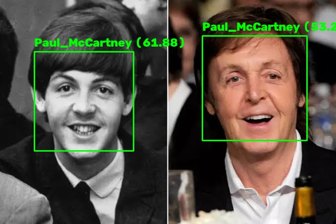
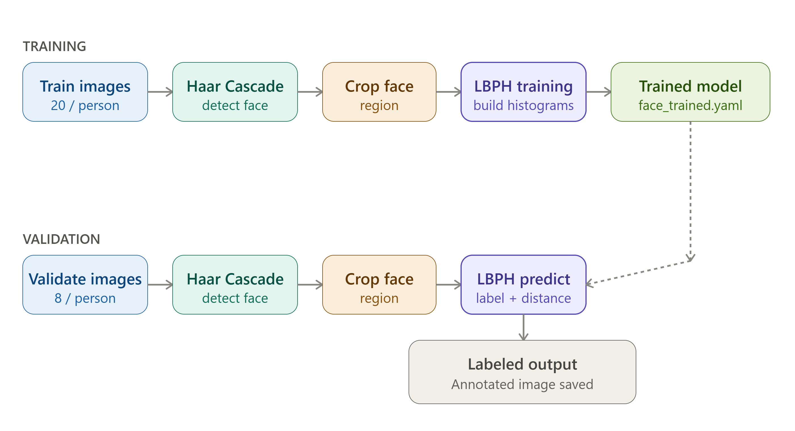
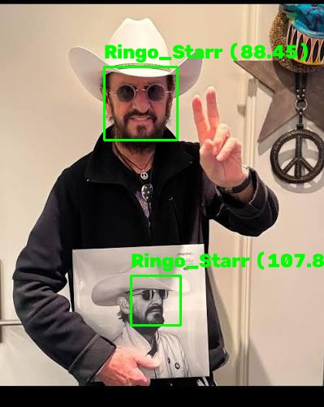
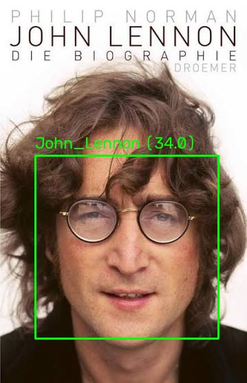
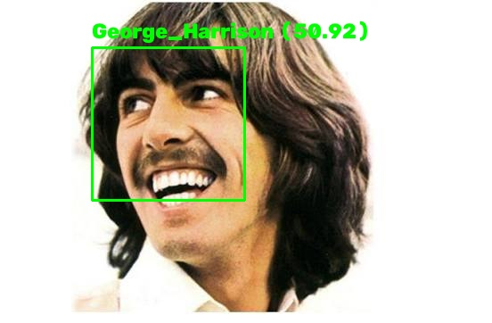
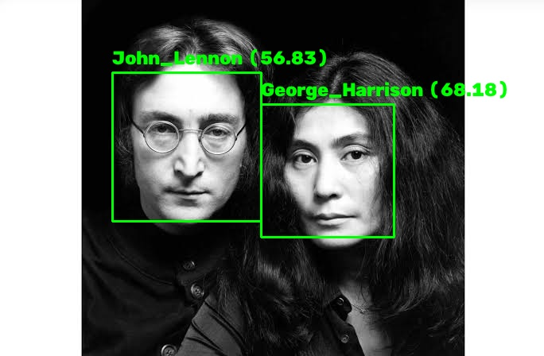
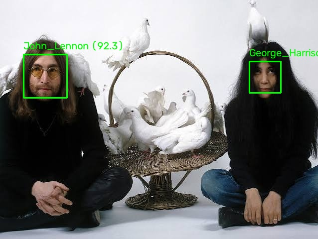
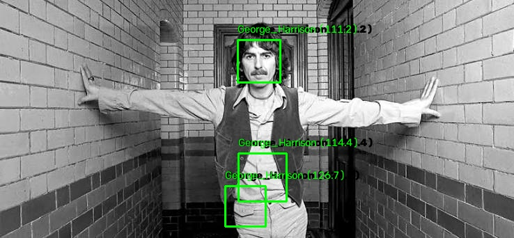
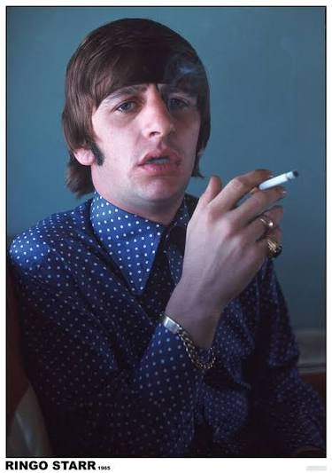

# Face Recognition Pipeline Using OpenCV LBPH

<div align="center">
    
</div>

## 🔍 Overview

<div align="center">
    
</div>

A face recognition pipeline built with OpenCV that identifies known individuals from detected face regions.

This project extends the previous **Face Detection** pipeline by adding an identity recognition stage. Where face detection answers *"is there a face, and where?"*, face recognition answers *"whose face is this?"*

The system combines:

- **Haar Cascade Classifier** — for face detection
- **LBPH (Local Binary Patterns Histograms)** — for face recognition

---

## 📋 Task Description

The system:

1. Loads a dataset of known individuals.
2. Detects faces using Haar Cascade.
3. Crops the detected face regions.
4. Trains an LBPH recognizer on the cropped faces.
5. Runs the trained model on unseen validation images.
6. Predicts an identity for each detected face.
7. Saves annotated results with predicted labels.

**Modes:**
- **Training Mode** — detects faces in training images and builds the LBPH model.
- **Validation Mode** — evaluates the trained model on unseen images and saves labeled results.

---

## 🛠️ Implementation Overview

Built with **Python**, **OpenCV**, **NumPy**, and OpenCV's **LBPH Face Recognizer**.

```text
Training images → Haar Cascade → Face crop → LBPH training → face_trained.yaml
                                                                      │
Validation images → Haar Cascade → Face crop → LBPH prediction ──────┘
                                                        │
                                              Annotated output images
```

Code is split into modules so each component has a single responsibility.

---

## ⚙️ Recognition Algorithm Overview

### 1. Face Detection

Same Haar Cascade detector as the face detection project:

1. Load the image.
2. Convert to grayscale.
3. Detect face regions with `detectMultiScale()`.
4. Extract the detected face regions.

### 2. Face Recognition Using LBPH

The cropped face regions are passed to OpenCV's LBPH recognizer, which:

1. Compares local binary patterns around each pixel.
2. Builds histograms describing local texture information.
3. Compares the histogram of an unknown face against trained examples.
4. Returns the closest matching identity.

```python
label, distance = face_recognizer.predict(face)
```

- `label` → predicted person
- `distance` → similarity distance (lower = closer match)

> Note: OpenCV calls this value "confidence," but it's actually a distance score — higher values mean a *worse* match, not a better one.

---

## 📁 Project Structure

```text
📁 _16_face_recognition
├── 📁 assets
│   ├── 📁 images
│   │   ├── 📁 train
│   │   └── 📁 validate
│   └── 📁 results
│       ├── 📁 train
│       └── 📁 validate
├── 📁 config
│   ├── constants.py
│   ├── face_trained.yaml
│   ├── features.npy
│   ├── labels.npy
│   └── paths.py
├── loader.py
├── main.py
├── recognize.py
├── saver.py
├── train.py
└── README.md
```

---

## ▶️ Running the Project

```bash
cd _16_face_recognition
pip install -r face_recognition_requirements.txt
python main.py
```

You'll be asked whether to regenerate training data:

```text
Overwrite the train results?
(0) No
(1) Yes
```

- **`1`** — detects faces in the training images, regenerates cropped face samples, and retrains the LBPH model.
- **`0`** — reuses the existing cropped samples and previous training results.

Then run recognition on the validation set:

```bash
python recognize.py
```

Annotated results are saved automatically.

---

## 🗂️ Dataset

Images of all four members of **The Beatles** — George Harrison, John Lennon, Paul McCartney, and Ringo Starr.

Per person: **28 images total** → **20 for training**, **8 held out for validation** (fully separated to test generalization).

---

## 📊 Validation Results

### Overall Performance

Evaluated on 4 people × 8 validation images = **32 total images**.

| Person | Correct | Total | Accuracy |
|---|---:|---:|---:|
| George Harrison | 4 | 8 | 50.0% |
| John Lennon | 5 | 8 | 62.5% |
| Paul McCartney | 3 | 8 | 37.5% |
| Ringo Starr | 1 | 8 | 12.5% |
| **Overall** | **13** | **32** | **40.6%** |

### ✅ Successful Recognitions

Recognition worked best when faces were frontal, lighting matched the training set, and facial features were clearly visible:

<table align="center">
<tr>
<td align="center">
<br>
<sub><em>Correct recognition — Ringo Starr</em></sub>
</td>
<td align="center">
<br>
<sub><em>Correct recognition — John Lennon</em></sub>
</td>
<td align="center">
<br>
<sub><em>Correct recognition — George Harrison</em></sub>
</td>
</tr>
</table>

### ⚠️ Misclassification Patterns

The main challenge was distinguishing between visually similar individuals:

| Actual | Frequently Predicted As |
|---|---|
| George Harrison | John Lennon, Paul McCartney |
| John Lennon | George Harrison, Ringo Starr |
| Paul McCartney | George Harrison |
| Ringo Starr | George Harrison |

Paul McCartney was the hardest case, most often misclassified as George Harrison. This tracks with how LBPH works: it compares local texture patterns rather than higher-level facial structure, so similar hairstyles, facial hair, lighting, and image quality can produce very similar feature signatures across different people.

---

## ❌ Interesting Failure Cases

**1. Unknown person classified as a known identity**

Images containing Yoko Ono (not part of the training set) were classified as George Harrison:

<table align="center">
<tr>
<td align="center"></td>
<td align="center"></td>
</tr>
</table>
<p align="center"><em>Unknown person incorrectly classified as George Harrison.</em></p>

LBPH is a **closed-set classifier** — it assumes every detected face belongs to one of the known classes and always returns its closest match, rather than an "unknown" label.

**2. A bad detection still gets "recognized"**

Recognition accuracy is bottlenecked by detection accuracy. If Haar Cascade flags a non-face region, LBPH will still try to classify it:

<div align="center">

</div>
<p align="center"><em>A non-face region incorrectly detected and classified.</em></p>

This likely traces back to training: a few cropped "face" samples were actually clothing or jewelry regions, so the model learned to associate those textures with a person. Since LBPH has no concept of what a face actually is, it can't reject detections like this.

**3. Occlusion causes detection — and recognition — to fail entirely**

In one Ringo Starr validation image, Haar Cascade failed to detect a face at all, likely due to smoke partially covering the face, a mouth position that altered the facial pattern, or reduced visibility of key facial regions:

<div align="center">

</div>
<p align="center"><em>Face detection failure due to partial occlusion — recognition never runs.</em></p>

Since no face was detected, the recognition stage never executed for this image.

---

## 🚧 Limitations

- Small training dataset
- Sensitive to lighting and pose variation
- Cannot reliably handle unseen individuals
- Relies heavily on raw image texture rather than facial structure
- Inherits false detections from the Haar Cascade stage
- No true "unknown person" rejection mechanism

## 🚀 Future Improvements

- Replace Haar Cascade with a deep learning-based face detector
- Replace LBPH with modern face embeddings (FaceNet, ArcFace, DeepFace)
- Add unknown-person rejection using a distance threshold
- Grow the training dataset
- Apply face alignment before recognition
- Benchmark classical methods against deep learning approaches

## 🏁 Conclusion

This project implements a complete classical face recognition pipeline using OpenCV. Haar Cascade and LBPH offer a lightweight, low-compute solution, but the results expose real limitations in real-world conditions — the system recognized several validation images correctly, but struggled with visually similar individuals, unseen faces, and occlusion.

These gaps are exactly why modern face recognition systems have moved to deep learning-based feature extraction, which produces more robust identity representations across pose, lighting, and environment.
